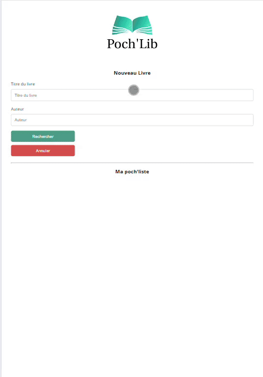

   # 📚 Poch'Lib 
  This application is meant to be used as a personalized booklist, using Google Books API. 

  ➡️ **Context :**
  “La Plume enchantée” asked me to create an application that will enable their clients to search for books online and then pick them up at the bookshop.

  ➡️ **Specifications :** 
  This project meets the requirements of the client, in terms of coding and design.

  
  ## 🎥 Sneak peak : 

**What can you _(the user)_ do with the Poch'Lib app ?**
* Search a book thanks to the Google Books API
* Add the books you want to your list by clicking on the bookmark icon
* Do as many research and addition to your list as you want (the more book the better, right ?)
* Remove the books from your list as you buy them (or read a bad review) by clicking on the trash icon

**What does it look like ?**

  

## ✅ How to get your hands on this app ? 
First of all, you need to "download" this project. 

To do so, open a terminal and : 
  1. Clone the project  

~~~bash  
  git clone https://github.com/LCTConcept/P6_PochLib_LeaChoquet
~~~

2. Go to the project directory  

~~~bash  
  cd my-project
~~~

3. Install dependencies  

~~~bash  
npm install
~~~

4. Start the server  

~~~bash  
npm run start
~~~  

Then, in your file directory of the project, you can open *index.html*. 

There you go, now you can try the app ! ✨

## Dev team 
- [@LCTConcept](https://github.com/LCTConcept)  

This project is part of the training "Salesforce Developer" :
P6_Create a user interface for your application.
